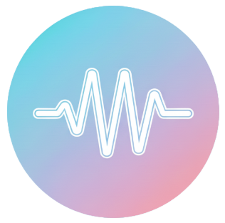

# Aria Voice Studio

**Comprehensive voice training application for transgender and non-binary individuals.**



Aria provides real-time pitch monitoring, vocal health analysis, guided exercises, and progress tracking to help you develop and maintain your authentic voice.

## Features

- **Real-time Voice Analysis** - Pitch detection, formant tracking (F1/F2/F3), and voice quality metrics
- **Guided Exercises** - Evidence-based vocal training exercises with real-time feedback
- **Multi-Profile System** - Separate profiles for different voice goals (MTF/FTM/NB)
- **Vocal Health Monitoring** - Track jitter, shimmer, HNR with weekly health grades
- **Achievement System** - Unlock achievements based on practice sessions, streaks, and goals
- **Progress Tracking** - Session history, practice calendar, and voice snapshots
- **Discord Integration** - Export and share your progress with the community
- **Privacy-First** - All data stored locally, no telemetry or cloud sync

## Installation

### Requirements
- Python 3.8 or higher
- Microphone access

### Setup

1. **Clone the repository**
```bash
git clone https://github.com/yourusername/aria-voice-studio.git
cd aria-voice-studio
```

2. **Install dependencies**
```bash
pip install -r requirements.txt
```

3. **Run the application**
```bash
python main.py
```

## Usage

1. **First Launch**: Complete the onboarding to set up your voice profile and goals
2. **Training Screen**: Start live training sessions with real-time pitch feedback
3. **Exercises**: Access guided exercises designed by voice training experts
4. **Progress**: Track your statistics, streaks, and achievements
5. **Health Dashboard**: Monitor vocal health with weekly grades and recommendations
6. **Settings**: Customize audio settings, microphone selection, and preferences

## Voice Training Exercises

- **Breathing Control** - Diaphragmatic breathing foundation
- **Humming Warmup** - Develop forward resonance
- **Lip Trills** - Improve breath support and reduce tension
- **Pitch Slides** - Expand range and control
- **Resonance Training** - Shift vocal tract placement
- **Straw Phonation (SOVT)** - Improve vocal efficiency and health
- **Connected Speech Practice** - Apply techniques in natural speech
- And many more advanced exercises!

## Safety & Health

- Research-based vocal strain thresholds (jitter, shimmer, HNR)
- Auto-pause on critical strain detection
- Rest day recommendations
- Multi-day fatigue tracking
- **Not medical advice** - consult a speech therapist for professional guidance

## Data Privacy

- All data stored **locally only**
- No cloud sync, telemetry, or analytics
- No internet required (except optional Discord bot)
- Explicit export required for Discord integration

## Discord Community (Optional)

Share your progress with the community via our Discord bot:
1. Export your stats from the Progress screen
2. Upload to Discord bot via DM
3. Use slash commands: `/stats`, `/achievements`, `/leaderboard`, `/compare`

See `../AriaDiscord/README.md` for bot setup instructions.

## Development

### Running Tests
```bash
python run_tests.py all
```

### Project Structure
- `core/` - Business logic (session management, achievements, health analysis)
- `voice/` - Audio analysis pipeline (pitch detection, formant analysis, safety monitoring)
- `gui/` - PyQt6 interface (screens, components, design system)
- `utils/` - Utilities (emoji handling, file operations, error handling)
- `data/` - User data (profiles, sessions, settings)
- `logs/` - Application logs

## Technologies

- **PyQt6** - Modern GUI framework
- **NumPy/SciPy** - Audio signal processing
- **librosa** - Audio analysis and feature extraction
- **sounddevice** - Real-time audio capture
- **matplotlib** - Data visualization

## Contributing

Contributions welcome! Please read our contributing guidelines and code of conduct.

## License

This project is licensed under the MIT License - see the [LICENSE](LICENSE) file for details.

## Acknowledgments

- Based on speech therapy research and trans voice training methodologies
- Inspired by the amazing trans voice training community
- Special thanks to all contributors and testers

## Support

- **Issues**: Report bugs via GitHub Issues
- **Discussions**: Join our Discord community
- **Documentation**: See `docs/` folder for detailed guides

---

**Version**: Public Beta v5 (October 2025)

**Note**: This is an educational tool, not medical software. For professional voice training guidance, please consult a qualified speech-language pathologist.
