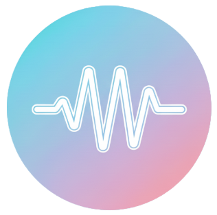

# Aria Voice Studio

**Comprehensive voice training application for transgender and non-binary individuals.**



Aria provides real-time pitch monitoring, vocal health analysis, guided exercises, and progress tracking to help you develop and maintain your authentic voice.

## Features

- Real-time voice analysis: pitch detection, formant tracking (F1/F2/F3), and voice quality metrics
- Guided exercises: evidence-based vocal training with real-time feedback
- Multi-profile system: separate profiles for different voice goals
- Vocal health monitoring: jitter, shimmer, HNR with weekly health grades
- Achievement system: unlock achievements based on practice sessions, streaks, and goals
- Progress tracking: session history, practice calendar, and voice snapshots
- Discord integration: export and share your progress with the community
- Privacy-first: all data stored locally, no telemetry or cloud sync

## Installation

### Requirements
- Python 3.8 or higher
- Microphone access

### Setup

1. Clone the repository
```bash
git clone https://github.com/VocalOpal/Aria.git
cd Aria
```

2. Install dependencies
```bash
pip install -r requirements.txt
```

3. Run the application
```bash
python main.py
```

## Usage

1. First launch: complete onboarding to set up your voice profile and goals
2. Training: start live sessions with real-time pitch feedback
3. Exercises: access guided exercises designed by voice training experts
4. Progress: track statistics, streaks, and achievements
5. Health dashboard: monitor vocal health with weekly grades and recommendations
6. Settings: customize audio settings, microphone selection, and preferences

## Voice Training Exercises

- Breathing control: diaphragmatic breathing foundation
- Humming warmup: develop forward resonance
- Lip trills: improve breath support and reduce tension
- Pitch slides: expand range and control
- Resonance training: shift vocal tract placement
- Straw phonation (SOVT): improve vocal efficiency and health

## Tech Stack

- Python 3.10+
- PyQt6 for the GUI
- NumPy/SciPy for signal processing
- librosa for audio analysis
- sounddevice for real-time capture
- matplotlib for visualization

## Releases

- Latest: `v5.2.0` (current main)
- Previous: `legacy-v5` (last pre-5.2 build)

## Contributing

Contributions welcome! Please read our contributing guidelines and code of conduct.

## License

This project is licensed under the MIT License - see the [LICENSE](LICENSE) file for details.

## Acknowledgments

- Based on speech therapy research and trans voice training methodologies
- Inspired by the trans voice training community
- Thanks to all contributors and testers

## Support

- Issues: report bugs via GitHub Issues
- Discussions: join our Discord community
- Documentation: see the `docs/` folder for detailed guides

---

Version: Public Beta v5 (October 2025)

Note: This is an educational tool, not medical software. For professional voice training guidance, please consult a qualified speech-language pathologist.